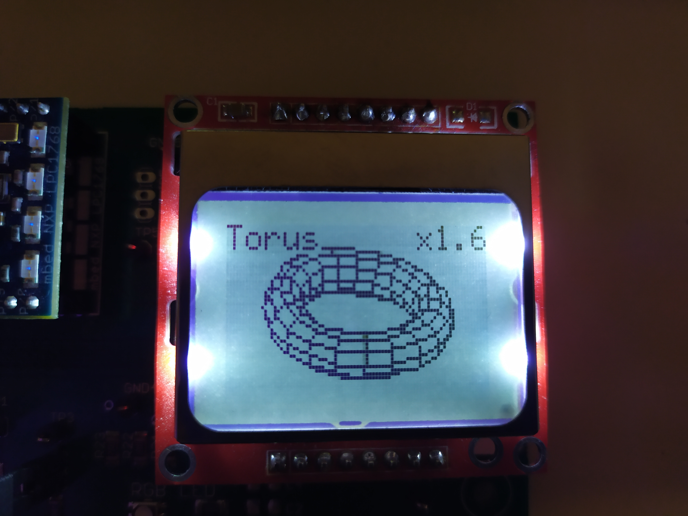
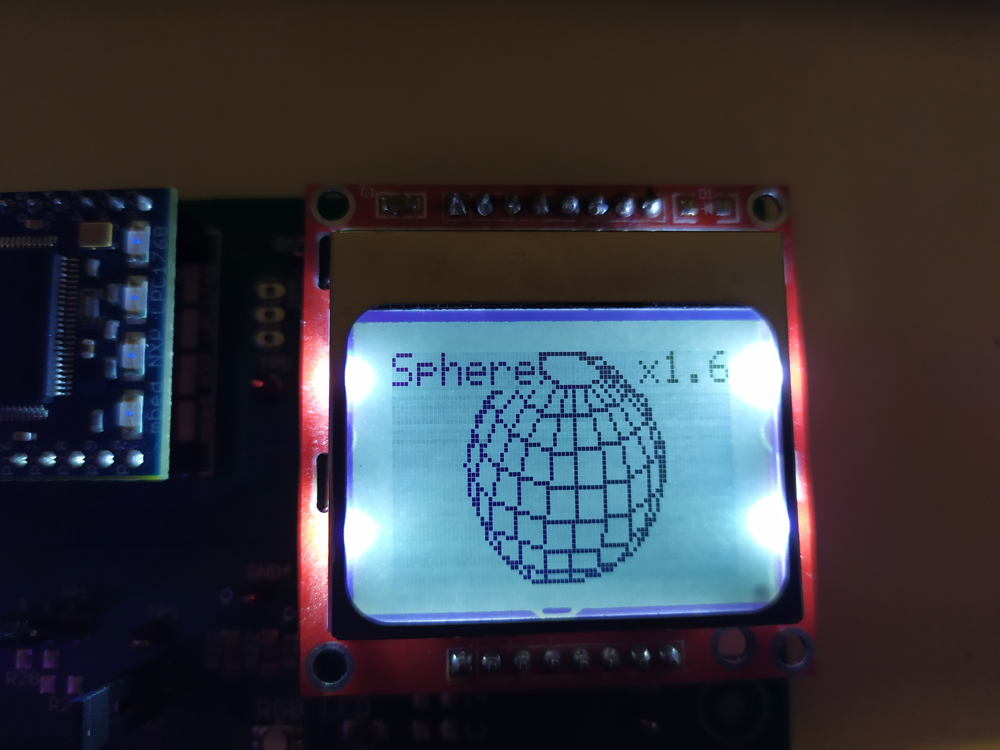
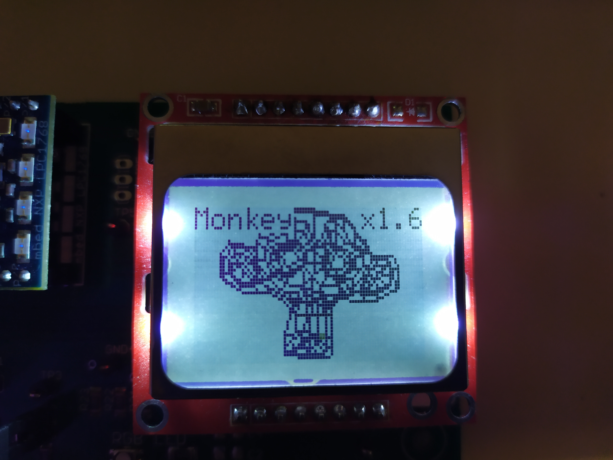

# 3D Rendering Engine on ARM LPC1768

## Overview

This project was developed as part of my university coursework, where the objective was to create a game using an ARM mbed LPC1768 microcontroller. I chose to implement a real-time 3D rendering engine and design a simple game around it to demonstrate its capabilities.

The system uses a Nokia 5110 LCD screen to display 3D objects and a joystick to control the camera view. Despite the limited processing power and memory, the engine supports:

- Real-time 3D rotation and translation
- Backface culling
- Z-buffer-based occlusion
- Efficient face filling using a custom flood fill algorithm
- Optimised pixel-level drawing for improved speed

## How It Works

Several optimisations were implemented to achieve smooth real-time rendering on the LPC1768:

- **Face Sorting and Depth Buffering**:  
  Each face is tested against a depth buffer (`depth_buffer[x][y]`) to determine visibility, ensuring that faces are rendered in the correct order.

- **Efficient Filling**:  
  Rather than relying on slower per-pixel algorithms, a custom fast flood fill was implemented. It uses a `fill_buffer` to mark drawable regions, allowing pixels to be updated in bulk.

- **Backface Culling**:  
  Faces oriented away from the camera are skipped entirely to reduce the number of drawing operations.

- **Joystick Camera Control**:  
  A basic joystick was used to enable real-time camera rotation and movement around the 3D object, allowing interactive exploration of the rendered scene.

## Gallery

  
  
  

